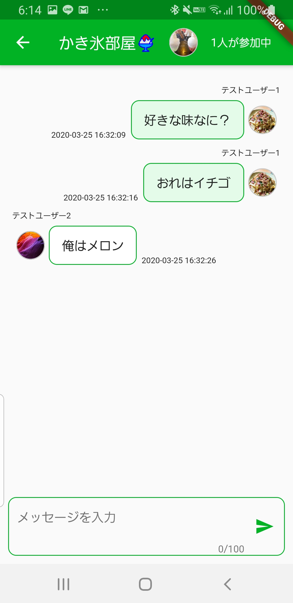

# Flutter Chat App

##アプリの概要
不特定多数の人とチャットを楽しむアプリ。
誰かがチャットルームを立ち上げるとほかのユーザーにもそのチャットルームが表示され、チャットに参加することができる。
また、自分のプロフィールを編集したり、ほかのユーザーのプロフィールを閲覧することもできる。

##アプリ全体の構造
※矢印（→）はページ遷移を示す。

##各画面の機能

###ログイン画面

既存のアカウントを用いてアプリにログインする。
認証はメールアドレス＆パスワードで行っている。
空欄があった場合は再入力を促す。
(**Firebase Authentication**)

###アカウント新規登録画面

アカウントの新規登録を行う。
空欄があった場合は再入力を促す。
また、アカウント名やメールアドレスが既に使われている場合やパスワードが脆弱な場合は、エラーのタイプごとに適したエラーメッセージを画面に表示する。
登録したユーザーのデータはCloud Firestoreで管理する。

(**Firebase Authentication, Cloud Firestore**)

###チャットルーム一覧画面

現在立ち上がっているチャットルームの一覧をCloud Firestoreから取得して表示する。タップするとそのチャットに参加することができる。
リストの右端にはそのルームの参加人数が示され、チャットに参加している人数をリアルタイムに反映する。
また、チャットルームの作成者のみ、左端のゴミ箱アイコンをタップするとそのルームを削除することができる。ただし、そのチャットに参加している人がいる場合は警告が出て削除することができない。
(**Cloud Firestore, Firebase Storage, 非同期処理**)

###チャットルーム作成画面

アイコンとルーム名を指定してチャットルームを作成する。
アイコンの画像は端末内の画像から選べる。
作製したチャットルームのデータはCloud Firestoreで管理する。
(**image_picker, Cloud Firestore**)

###チャット画面

チャットのメッセージを閲覧したり、画面下部のテキストフィールドからチャットにテキストを送信することができる。チャット内のメッセージの管理はCloud Firestoreで行っている。
自分以外のユーザーのメッセージ横のアイコンをタップすると、そのユーザーのプロフィールを見ることができる。
AppBarにはチャットルームに参加中の人数が表記されており、変動があればリアルタイムに反映する。
(**Cloud Firestore**)

###プロフィール編集画面

自分のプロフィール（プロ画、ユーザー名、コメント）を編集することができる。このプロフィールは他のユーザーに公開される。プロ画は端末内の画像から選択することができる。
ユーザープロフィールはCloud Firestoreで管理する。
(**image_picker, Cloud Firestore**)